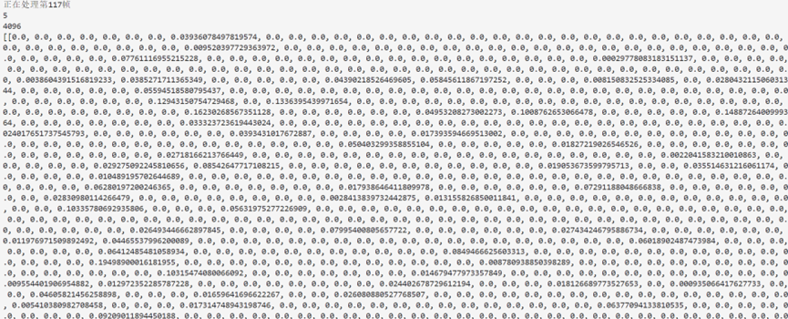
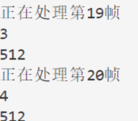
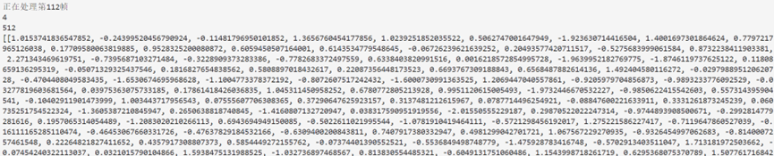
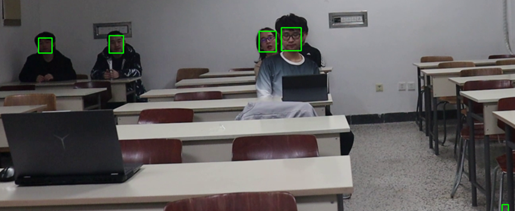
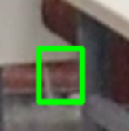
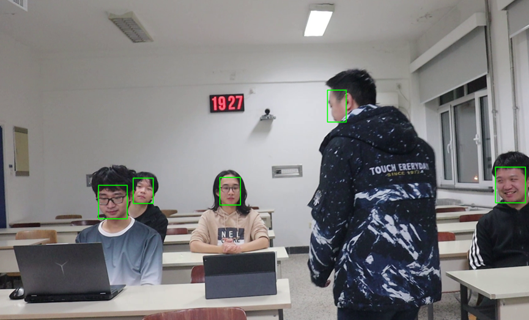
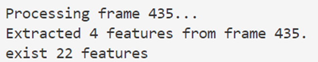
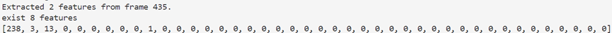

# FaceID部分报告
FaceId部分主要的工作为：将输入的每帧图片中的人脸检测出来并提取其特征向量，返回给识别模块进行后续的识别任务
### 前期调查
在早期选择人脸检测及提取特征方法时，我使用了一个集成式的库Deepface，它集成了多种方法（例如facenet，arcface，openface等）。通过比对各种方法在相同的几段自采视频上的检测效果来最终决定使用的方法。

我最终测试了如下几种方法：vggface,facenet（包含128维和512维两种）,arcface和openface

* **首先是vggface方法**，由于其输出的是4096维向量，而我们的测试数据极其有限，只有五张人脸，因此其提取到的特征向量非常稀疏，并不适合
*图1：vggface的检测结果*
*（第二行是已有人脸数，第三行是向量维度，后面是得到的特征向量列表，下同）*

* **第二种是facenet方法**，其有128维和512维两种版本，由于后来发现GitHub上的facenet-pytorch仅提供了512维版本，因此在两种版本间对比不在此赘述。其测试效果极佳，当相似度阈值取到0.7时，无论是正常情况还是都坐在后排的情况都能较快地检测出所有人脸（后排情况下露出脸的只有4人）

*图2，3：facenet在后排情况下检测结果*
出于美观性考虑更多结果不再展示，仅存放在images文件夹中，按照报告提及顺序进行标号

* **第三种方法是arcface**，实际上这种方法也相当不错，对于正常情况，相似度阈值只需取到0.6即可迅速顺利完成五张人脸的检测。由于我选择的策略是放宽相似度阈值以应对可能存在的复杂情况，因此得到正确结果所需的阈值越低调整空间越大，在这方面arcface效果不错。不过在面对人都在后排的情况时，如果不调节阈值，检测效果会略逊于facenet，在0.6阈值下无法完整进行检测。
总体而言两种方法可以说是相当的。但arcface在GitHub上的项目中例子以及教程都比较简短，而我作为初学者比较担心能否顺利在短时间内解决遇到的问题；而facenet的项目中不仅有许多例子，而且readme文件和各种例子都有官方找人翻译的中文版本，非常详尽，因此其实让我放弃arcface而选择facenet的主要原因是这个。 

* **最后一种方法是openface**，这种方法效果并不好，对于正常情况，阈值选择0.7时无法完整检测，而阈值选择0.8又会远远超出正确人数，无论是因为对阈值敏感还是本身效果不好，都不太适用于本次任务，因此选择放弃了。

### 技术方案介绍
facenet方法功能较为完善，并且配有多种预训练模型。

具体到该任务上，我使用了其内部的mtcnn深度学习模型进行人脸检测，Inception ResNet(V1)深度卷积神经网络架构进行人脸特征提取，同时为了解决数据缺少的问题，我使用了其自带的在vggface2上训练的预训练模型。在使用get_features_list函数得到每帧图像的特征列表后，再使用is_new_feature函数对得到的特征进行检测，根据余弦相似度判断是否是全新的人脸特征，并对现有的人脸特征列表进行维护更新。

为提高提取效率，在get_features_list函数中我对每张图片中的人脸进行了批量化处理，将所有人脸作为一个batch进行特征提取，减少了Inception ResNet(V1)网络的使用次数

在进入实际运行时，发现有如下问题：一、观看测试过程的视频，发现时不时会在完全没有人的地方检测出一个人脸框；二、有些并不好的脸部（比如正在侧身走动的人）得到的向量也会被加入，而只要每一个人有一个好的正脸特征向量即可用于识别了。因此我实现了一个过滤有效人脸的功能

*图4，5，6：错误人脸及无用侧脸检测示例*

由于根据视频显示，这些错误不会连续出现，而且通常远小于人脸框，因此我通过在不同区域记录连续出现人脸的帧数，并设置连续出现帧阈值和人脸框大小阈值来判断检测到的人脸是否为有效人脸。最终有效降低了错误人脸特征的存储量：

*图7，8：有人走动遮挡镜头时处理前后结果，其中图8第三列为不同区域检测到人脸的连续帧计数*

更多的测试结果放在images文件夹中，命名为valid+数字，连续两张图表示某种情况下处理前后的检测结果

### 总结
总体来说由于前期进行了比较详细的调查，基础功能实现起来并没有遇到太多困难，但是有很多实际运行起来后遇到的小问题：原方法返回值类型不统一（当未检测到人脸时会直接返回None而非空列表）导致与其他模块无法顺利结合；所需的torch版本又老又严格，险些无法与其他模块统一等等。这些都提醒我在合作过程中，要提前与他人进行详细的沟通，否则在更大的项目中可能会遇到更多类似的小问题，最终导致无法运行。

而更大的问题同样存在：由于我的方法中使用的检测和提取方法运行都较慢，因此主程序不得不采用从每秒中只提取其中一两帧传给我进行检测，而这实际上与我的连续帧检测逻辑上不太相容：跳跃帧数过多的情况下人脸很有可能会在不同区域间跳跃，导致正确人脸无法被检测。因此我只能将阈值设置的很低，所以实际工作中起到的效果并不是很大。

这也警示我在实现新功能时，不仅要考虑这个问题本身，还要更多的考虑大的框架以及和其他模块的配合问题，才能保证实现的新功能对于整个系统是有效的。

未来如果要进一步地优化该工具，我认为可能要考虑轻量化以及过滤功能中人脸连续出现的检测区域设置的优化问题。因为目前整个系统在人脸检测模块上耗费的时间最多，进而导致了检测数据要十几倍地减少，并因此降低了检测精度和过滤功能。同时在测试过程中也发现了即使是目前只有五个人的情况，也有可能出现多个人脸检测区域大量重合的情况，面对更复杂的情况时这种方法可能会存在更多实际问题，这方面还需要更多巧思来进行优化。